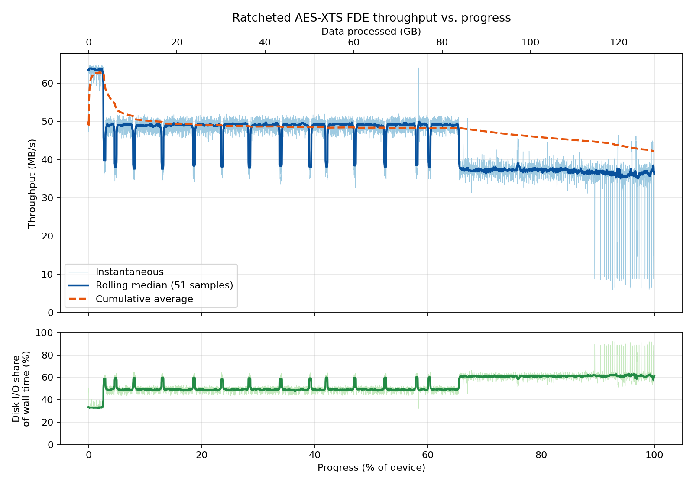

# Ratcheted FDE Implementation on hard drive

See [fde-c-3](/fde-c-3/README.md)

## Building and running

This program only works on Linux systems.

Run `make test-drive` to build the files.

To use the program (`build/fde_test_drive`) to encrypt/decrypt a drive, first connect the drive and find where it is located (say `/dev/sda`), then run the following:
```
build/fde_test_drive <encrypt/decrypt> <device> [offset_bytes] [count_bytes] [csv_path] [direct]
```
So to encrypt the entire drive in `/dev/sda` for example (without buffering, using O_DIRECT flag), and write the timing data into `results/drive_throughput.csv`, run
```
build/fde_test_drive encrypt /dev/sda 0 0 results/drive_throughput.csv direct
```

## Preliminary testing and results

**Setup:** 128 GB device, 4 KB sectors (31.26M sectors), `O_DIRECT` with 1 MB batched I/O, per-sector crypto. 9,393 samples.

### Overall
- Total time: **3033 s**, cumulative throughput **42.2 MB/s** (median sample 48.0 MB/s).
- Throughput by disk position: ~51 MB/s (first 10%), ~48 MB/s (to ~60%), ~37 MB/s (60-90%), ~34 MB/s (last 10%).

### Time breakdown
| Component | Time | Share |
|---|---|---|
| Disk I/O | 1687 s | 55.6% |
| Crypto | 1040 s | 34.3% |
| Other overhead | 306 s | 10.1% |

- Within crypto: data 76%, evolution 24%, seed ~0.15%.
- Per 4 KB sector: ~25.4 µs data, ~7.8 µs evolution, ~54 µs I/O.


